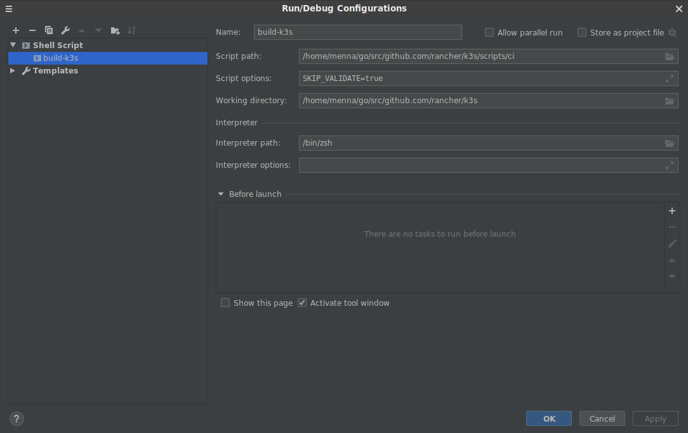

# Setting up the developement environment for k3s
First we need to
## Install dependencies  
  
   - ### Install golang 
        Here in Rancher labs we use golang for most of our projects so, first we need to install golang on your machine. You can download the golang binaries from https://golang.org/dl/ and extract it into usr/local as root, to create a go tree in /usr/local/go

        ``` sudo tar -C /usr/local -xzf go$VERSION.$OS-$ARCH.tar.gz```
        
        
   - ### Install docker 
      After you install docker you need to change user permissions to be able to run docker commands.
   ``` 
     sudo apt install docker.io
     sudo usermod -aG docker ${USER}
     newgrp docker 
   ```
     
   - ### Install k3d
        - [k3d](https://github.com/rancher/k3d)
            The big advantage of k3d, besides the speed of k3s, is that you can create a multi-cluster setup locally. The downside is that you won't have the full K8's feature set, see the [k3s repo](https://github.com/rancher/k3s) for more info on that. The readme has install instructions, note that you'll have to point Rancher at the custom kube config since it lives in a non-standard location. 
            use the install script to grab the latest release:
            
            wget: ``` wget -q -O - https://raw.githubusercontent.com/rancher/k3d/master/install.sh | bash```
            
            curl: ``` curl -s https://raw.githubusercontent.com/rancher/k3d/master/install.sh | bash```


## Set up your workspace
 -  ###  create workspace folder
   cd to where you want to create your workspace, which will include your projects and make a workspace folder that contains of 3 sub-folders,
   here we workspace is created on ```$HOME``` directory
   
   
   - src : where you'll write your code
   - pkg : where liberary or 3rd party package will be
   - bin : where will be the build files of your projects
   ```cassandraql
    cd
    mkdir -p <workspace_name>{,/bin,/pkg,/src}}
    mkdir -p <workspace_name>/src/github.com/rancher        
```

  - ###  Edit the environment variables
    The GOPATH environment variable lists places to look for Go code. So it has to be set to your workspace using the following commands
    to ensure that it's set for everytime you login to your machine. 

    ``` vim ~/.profile```
    Add the following
    ```
    export GOPATH=$HOME/<workspace_name> 
    export PATH=$HOME/<workspace_name>/bin:$PATH:/usr/local/go/bin 
    ```
    now you can test your environment by running any go code file. 

## IDE
Most of us at Rancher labs use [GoLand](https://www.jetbrains.com/go/), and the rest of this document will be 
written assuming you are as well, but there are several options
  - [GoLand](https://www.jetbrains.com/go/)
  - [vim + vim-go](https://github.com/fatih/vim-go)
  - [VS Code + vscode-go](https://github.com/Microsoft/vscode-go)
  - [Atom + go-plus](https://atom.io/packages/go-plus)

For ubuntu users GoLand is available on SnapStore. 

## git


Now with your environments set up, clone the repo of k3s into your workspace using the following command after you fork it in your own repo in order to avoid accidentally creating a branch in the rancher/k3s repo.
``` 
cd <workspace_name>/src/github.com/rancher
git clone git@github.com:<github_user_name>/k3s.git 
```
Also clone other dependencies for k3s when needed like: 
- [helm-controller](https://github.com/rancher/helm-controller)
- [system-upgrade-controller](https://github.com/rancher/system-upgrade-controller)
- [containerd](https://github.com/rancher/containerd)
- [cri](https://github.com/rancher/cri)
- [flannel](https://github.com/rancher/flannel)
- [kubernetes](https://github.com/rancher/kubernetes)
- [wrangler](https://github.com/rancher/wrangler)
- [kine](https://github.com/rancher/kine)
- [dynamiclistener](https://github.com/rancher/dynamiclistener)

in a similar manner, you can clone any of these liberaries, for example: 
``` 
cd <workspace_name>/src/github.com/rancher
git clone git@github.com:<github_user_name>/kine.git 
git clone git@github.com:<github_user_name>/helm-controller.git 
```

Then into the k3s directory you add a remote of the original k3s [repo](https://github.com/rancher/k3s)

```cassandraql
cd k3s
git remote add upstream https://github.com/rancher/k3s
``` 
now check remote ``` git remote -v ``` and they should be like
```
origin  git@github.com:MonzElmasry/k3s.git (fetch)
origin  git@github.com:MonzElmasry/k3s.git (push)
upstream        https://github.com/rancher/k3s (fetch)
upstream        https://github.com/rancher/k3s (push)
```

and you fetch the latest changes :

```cassandraql
git fetch upstream
``` 
go the latest commit from upstream/master branch :
```
git checkout upstream/master
```
create new branch from this commit :
```
git checkout -b new_branch
```
## Run! 

In k3s, there's two opetions to run your project, either to run the makefile
```make -f Makefile ``` 
or add the configuration to goland to point at the ci script
, at the top right corner , click on ```Add Configuration```  
Set the script path to <workspace>/rancher/k3s/scripts/ci
and the working directory to k3s project location. 



## Test your build 
The following commands will copy your binaries to /usr/local/bin and install k3s from the binaries instead of downloading from github releases
```cassandraql
sudo cp dist/artifacts/k3s /usr/local/bin
curl -sfL https://get.k3s.io | INSTALL_K3S_SKIP_DOWNLOAD=true sh -
```

## Uninstall k3s
Finally if you need to uninstall k3s, you can call the uninstall script located in /usr/local/bin
```cassandraql
k3s-uninstall.sh
```


